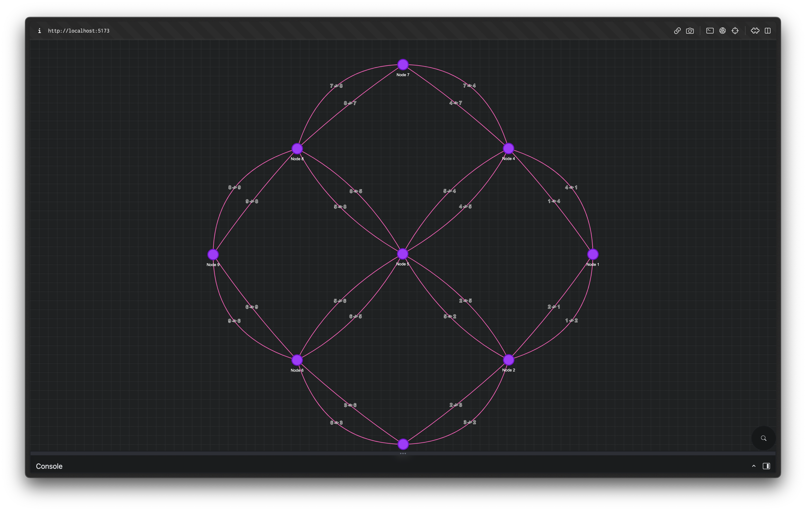
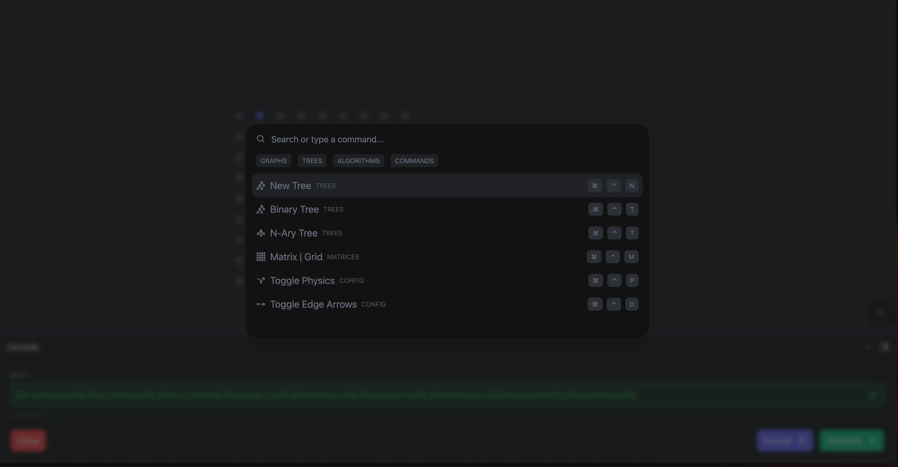

# GraphFlow Application

Welcome to GraphFlow, a React Typescript application that allows you to visualize graphs based on input matrices. GraphFlow uses tailwindcss for styling and visjs for data visualization.

## Demo Video

Check out the demo video to see GraphFlow in action! 

## Getting Started

To get started with GraphFlow, simply clone the repository from Github and install the dependencies using `npm install`. Then, start the application using `npm run dev` and you're ready to go!

## Goals

I really enjoy solving [LeetCode](https://leetcode.com/adia-dev/) problems and I often find myself visualizing the data structures that I'm working with. I wanted to create a tool that would allow me to visualize data structures in a simple and intuitive way. GraphFlow is the result of that goal.

## Usage

Using GraphFlow is easy! Start by entering your input in the form of a matrix. Once you've entered your input, simply click on the "Submit" button and GraphFlow will display the corresponding graph based on your input. It's that simple!

### Quick Actions

Make sure to use the `Quick Actions` (cmd+k on Mac) to quickly add/remove nodes and edges. You can also use the `Quick Actions` to add/remove weights from edges and more to come!

## Future Plans

The goal of GraphFlow is to represent various data structures such as graphs, linked lists, trees, AVL trees, and more. Additionally, there are plans to add a code editor that would allow the execution of code to traverse the tree and receive live visual feedback. Stay tuned for more updates!

## Contributing

Contributions to GraphFlow are welcome. If you have an idea for a new feature or want to make improvements to GraphFlow, simply submit a pull request with your changes.

## License

GraphFlow is licensed under the MIT License. For more information, please see the [LICENSE](https://github.com/example/example/LICENSE) file.
